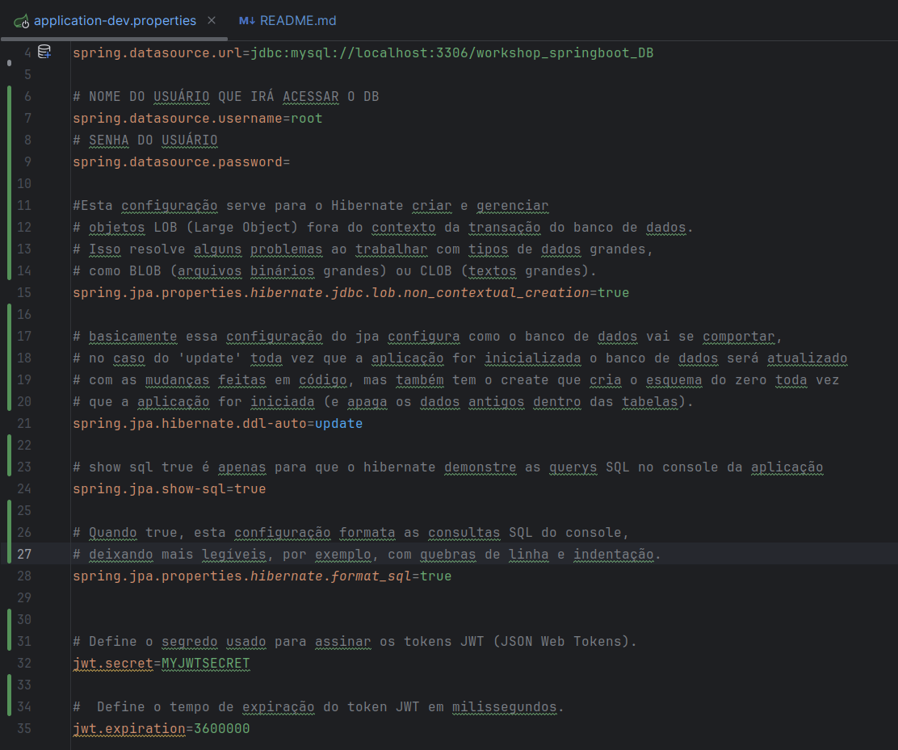
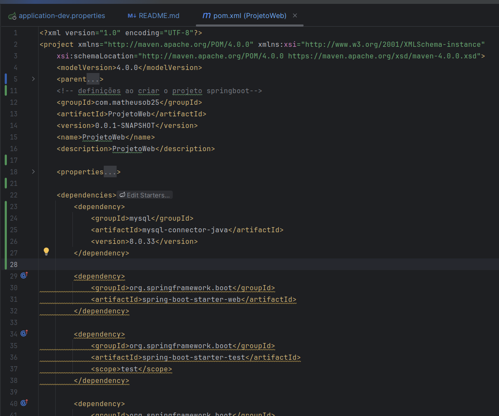
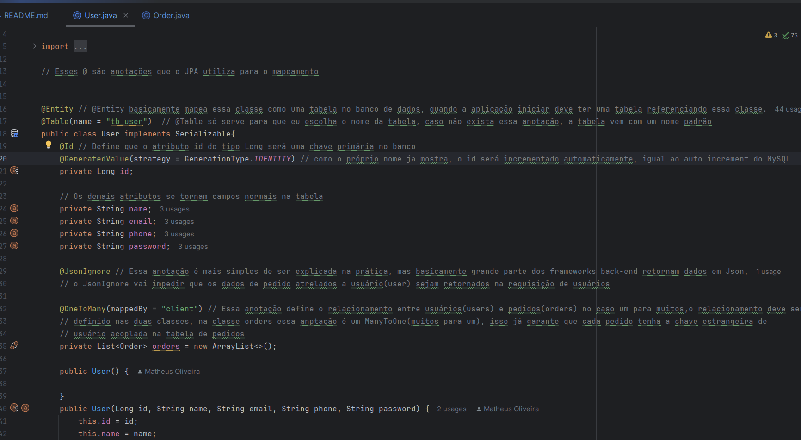
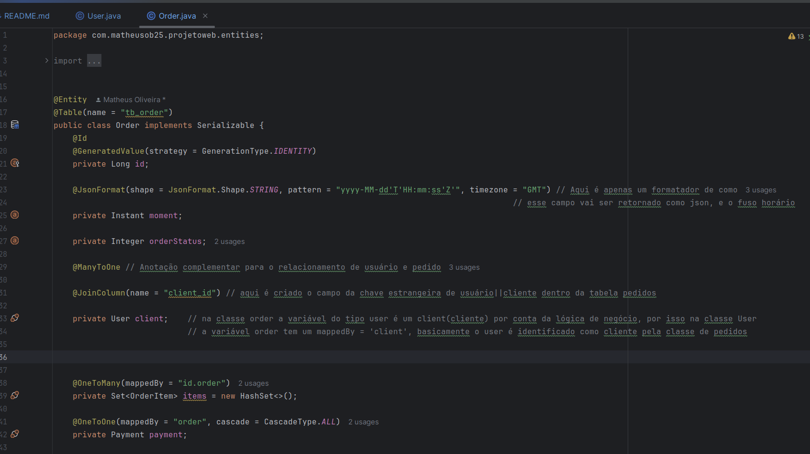
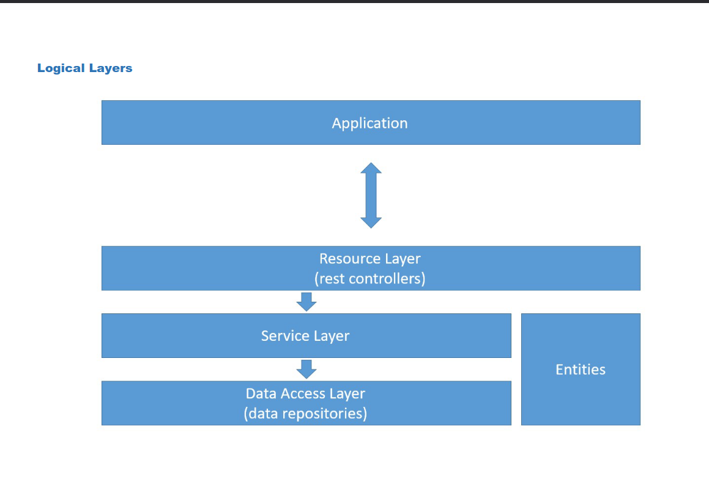

# Exemplo simples de API REST em SpringBoot

Esse documento tem o intuito de mostrar o funcionamento de funções simples como cadastro de usuário e login, e também como funciona o mapeamento objeto-relacional com JPA(Java Persistance API) em uma  relação N:N entre a entidade usuário e pedido. Isso será feito com o intuito de tentar mostrar um pouco sobre a criação de APIs com o framework Spring Boot e a linguagem java.

## Arquivo de configuração da aplicação

 
    Esse é só um exemplo, existem outros arquivos de configuração como o de teste com bancos relacionais leves e simples de utilizar a fim de acelerar o desenvolvimento. 
    
## Gerenciador de dependências 

Existem dois gerenciadores de dependências sendo eles o gradle e o maven, eu utilizei o maven por ser mais simples e declarativo, ou seja eu defino no arquivo de configuração que quero algo, como o driver do JDBC mysql,em seguida o maven gerencia como irá fazer isso e traz a dependência, o maven utiliza o XML para as configurações. O gradle é mais flexível e pode ser configurado por script para algo mais complexo, é baseado em script groovy ou kotlin. No geral ambos podem ser escolhidos e funcionam bem para o java, mas caso o java e o Spring sejam escolhidos, ainda será debatido a esocolha de um desses dois.

### Arquivo pom.xml onde o Maven é configurado

    Basicamente aqui o ponto importante  são as dependências, um exemplo é a dependência do driver do mySql no começo do escopo de dependencies,essa estrutura de dependency já vem pronta no site Maven Repository, para que ele atualize eu só preciso rodar o arquivo pom.xml e o meu driver de conexão do mysql estará funcionando.

## Como funciona o Mapeamento objeto relacional do JPA nas classes
### Classe User

    Nesse exemplo eu crio uma classe usuário normal com construtores, getters e setters, toString e oque mais for necessário, para que essa classe se torne uma entidade no banco eu só preciso passar as anotações da forma que está na imagem. Ficou um pouco extenso mas cada anotação está explicada por comentários no código.

### Classe Order

    
    Aqui eu ignorei outros relacionamentos e foquei na explicação da relação entre usuário e pedido para termos apenas uma visão menor de como tudo isso funciona.

## Explicação da Arquitetura em camadas utilizada nesse projeto

    Basicamente no topo a gente possui a aplicação que somente vai se comunicar com o resource por requisições http, o único propósito das resources é transformar os dados em requisições(get, post, put e delete) e definir como serão as rotas e o formato da URL.
### Exemplo de resources