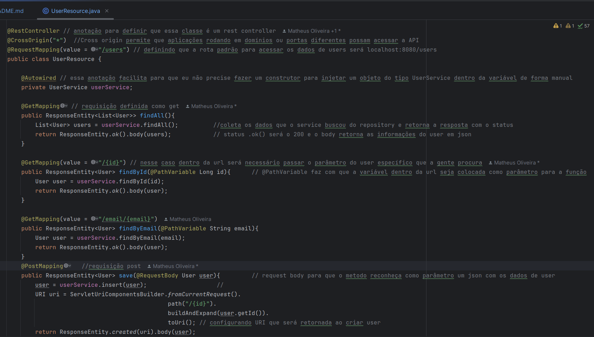
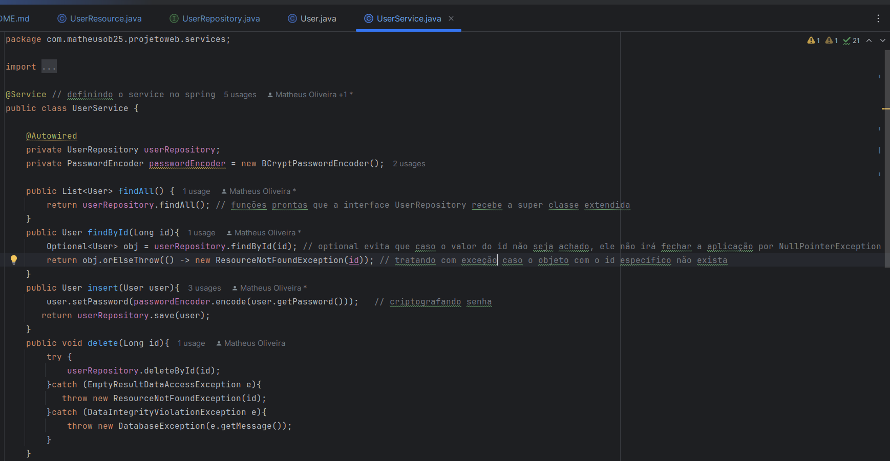
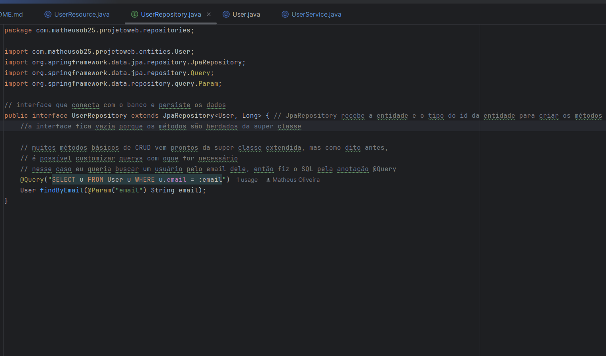
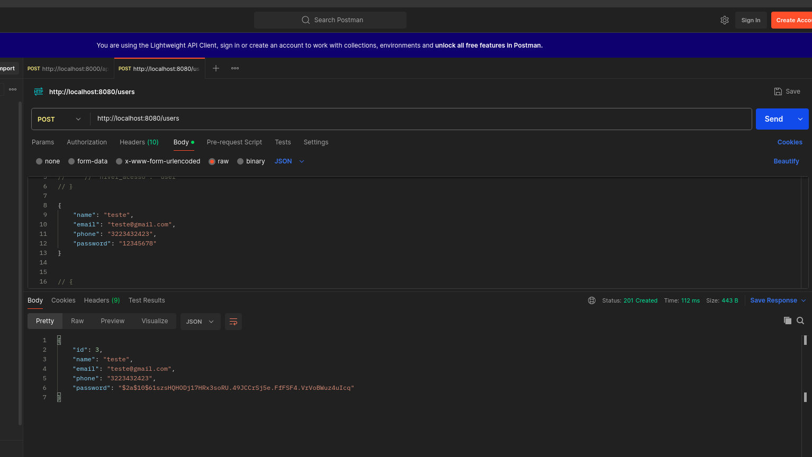
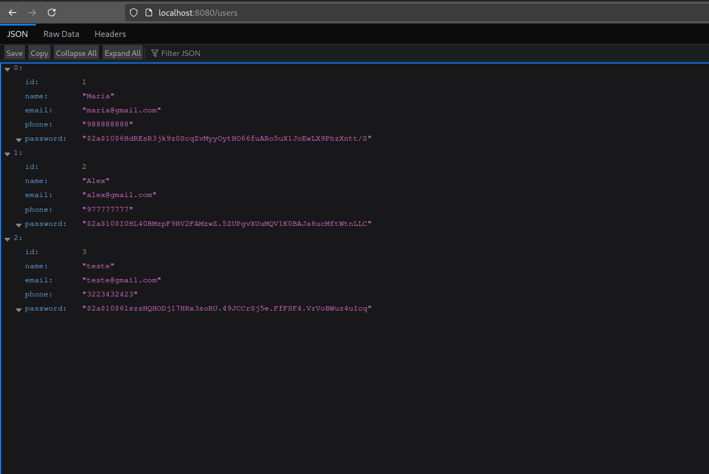

# Exemplo simples de API REST em SpringBoot

Esse documento tem o intuito de explicar brevemente sobre com funciona a criação de APIs com o framework Spring Boot e a linguagem java, é explicado um pouco soobre o gerenciador de dependências maven utilizado pelo java, arquitetura em camadas para melhor organização do código, mapeamento objeto relacional com JPA(Java Persistence API) e também cada uma das camadas utilizando de exemplo a entidade de usuário.

## Arquivo de configuração da aplicação

 
    Esse é só um exemplo, existem outros arquivos de configuração como o de teste com bancos relacionais leves e simples de utilizar a fim de acelerar o desenvolvimento. 
    
## Gerenciador de dependências 

Existem dois gerenciadores de dependências sendo eles o gradle e o maven, eu utilizei o maven por ser mais simples e declarativo, ou seja eu defino no arquivo de configuração que quero algo, como o driver do JDBC mysql,em seguida o maven gerencia como irá fazer isso e traz a dependência, o maven utiliza o XML para as configurações. O gradle é mais flexível e pode ser configurado por script para algo mais complexo, é baseado em script groovy ou kotlin. No geral ambos podem ser escolhidos e funcionam bem para o java, mas caso o java e o Spring sejam escolhidos, ainda será debatido a esocolha de um desses dois.

### Arquivo pom.xml onde o Maven é configurado

    Basicamente aqui o ponto importante  são as dependências, um exemplo é a dependência do driver do mySql no começo do escopo de dependencies,essa estrutura de dependency já vem pronta no site Maven Repository, para que ele atualize eu só preciso rodar o arquivo pom.xml e o meu driver de conexão do mysql estará funcionando.

## Como funciona o Mapeamento objeto relacional do JPA nas classes
### Classe User

    Nesse exemplo eu crio uma classe usuário normal com construtores, getters e setters, toString e oque mais for necessário, para que essa classe se torne uma entidade no banco eu só preciso passar as anotações da forma que está na imagem. Ficou um pouco extenso mas cada anotação está explicada por comentários no código.

### Classe Order

    
    Aqui eu ignorei outros relacionamentos e foquei na explicação da relação entre usuário e pedido para termos apenas uma visão menor de como tudo isso funciona.

## Explicação da Arquitetura em camadas utilizada nesse projeto

- ### Camada de resources
    - Basicamente no topo a gente possui a aplicação que somente vai se comunicar com o resource por requisições http, o único propósito das resources é receber os métodos da camada de services e  transformar esses dados em requisições(get, post, put e delete) e definir como serão esses endpoints e status das respostas.
- ### Camada de services
    - Essa camada irá conter toda a lógica de negócio do sistema e também vai ter acesso aos repositories para receber e tratar as funções de CRUD.
- ### Camada de repositories
    - As repositories é aonde acontece a persistência do banco de dados, no contexto do spring é criada uma interface com os métodos simples de CRUD feitos com as entidades, também é possível fazer querys personalizadas e mais complexas caso necessário.
- ### Camada de entities
    - Essa camada é a mesma mostrada no início do documento, ela serve como objeto que irá receber os dados persistidos do banco, essa é uma das camadas mais simples com métodos básicos como getters e setters, construtores e outros métodos auxiliares. Cada classe é associada a uma tabela no banco.

## Exemplo de resource

## Exemplo de service

## Exemplo de repository

## Mostrando cadastro de usuário funcionando no postman com body json

## Listando todos usuários pelo navegador com a url de users

